# Great tools, written in Rust

See bottom for installation instructions and web links.

# Here are my Top 10 :)

## 10. List files and directories -- with icons and Git status

Use `eza` instead of `ls` or `tree`.

```bash
$ eza --icons
```

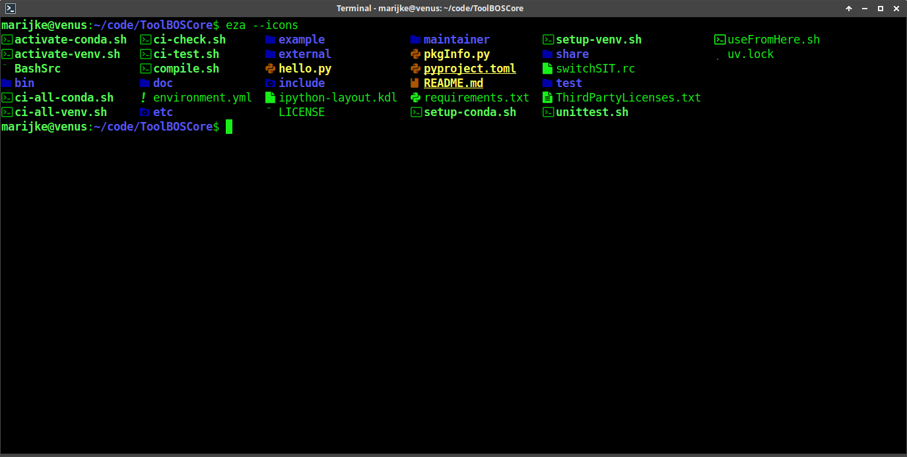

Here in tree-view mode, with icons, Git status, and a different color theme:

Note: Make sure you do not have `$LS_COLORS` set in your environment, as this
will override the theme colors!

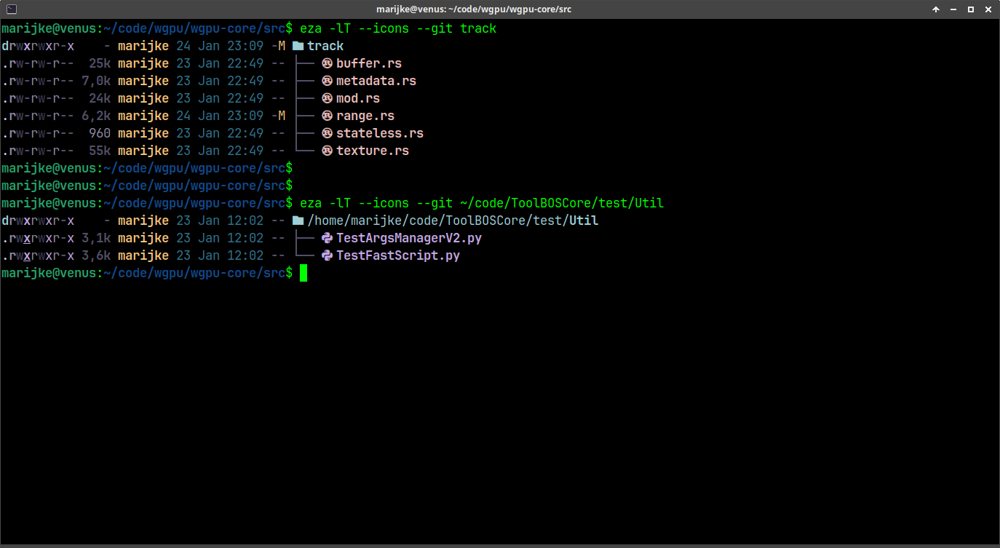

## 9. Print file content -- with syntax highlighting and Git diff

Use `bat` instead of `cat`/`more`/`less` to print files.

Note: Debian/Ubuntu install the executable under the name `batcat`.

```bash
$ bat main.rs          # or "batcat main.rs" on Debian/Ubuntu
```
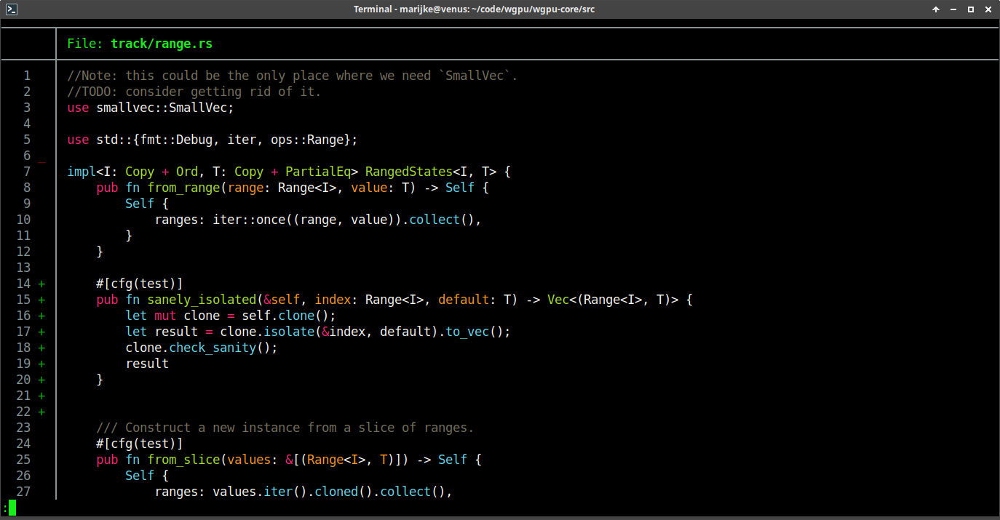

## 8. Calculator and unit converter -- supporting currencies

Use `fend` instead of `bc`.

```bash
$ fend
```
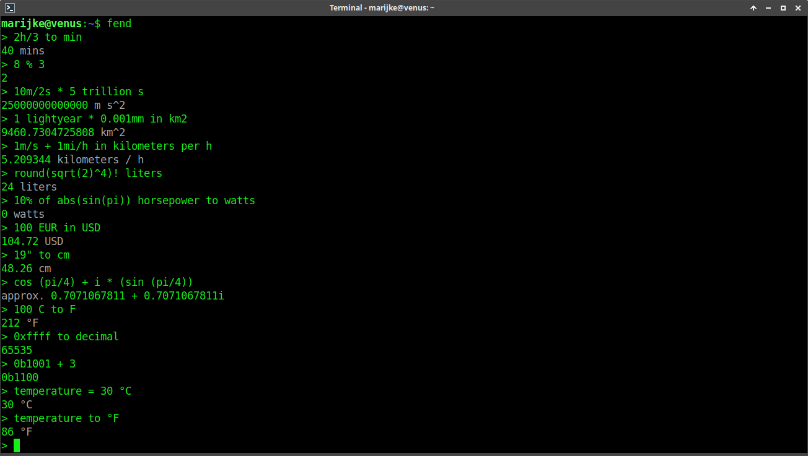

## 7. Show system load -- incl. disks, network and temperature

Use `btm` (bottom) instead of `top`.

```bash
$ btm
```
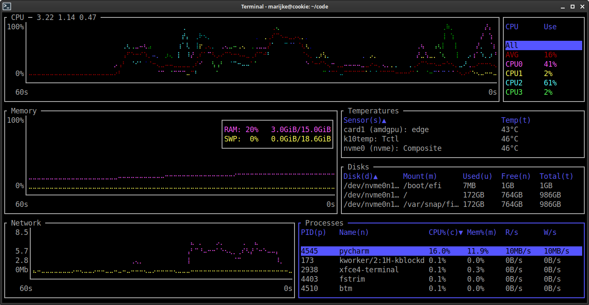

## 6. Identify duplicate files -- and replace them by hardlinks

Use `fclones` to determine redundant file copies.

Pipe its output into another `fclones`-instance to apply deduplication:

```bash
$ fclones group .

$ fclones group . | fclones link
```
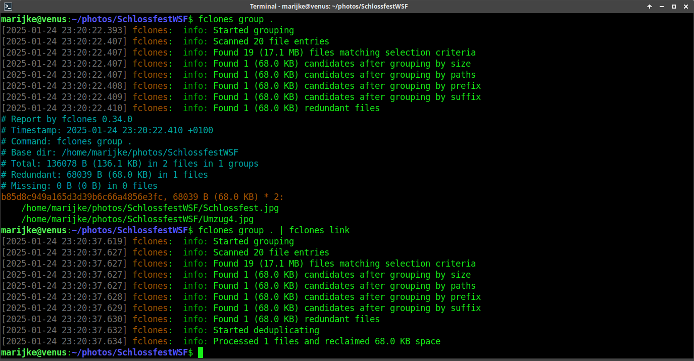

## 5. Replace strings in files -- incl. regular expressions

Use `ruplacer` instead of `find` and `sed` constructs.

Note: By default, works recursively on all files, and in regex mode.\
Pass "--no-regex" to search and replace strings containing parentheses etc.,
such as "Copyright (c)" notes.

Performs a dry-run by default. Pass the `--go` option to actually change
the files:

```bash
$ ruplacer [--no-regex] [--go] <OLD> <NEW> [WHERE]
```
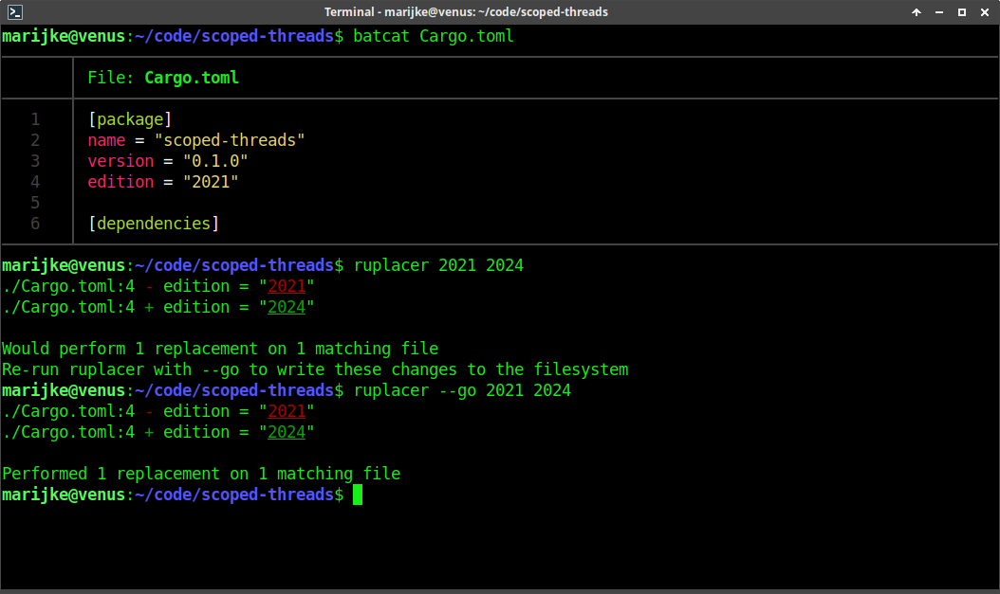

## 4. Automate dependent tasks -- but simpler than with Makefiles

Use `just` instead of `make`.

Create a `Justfile` (or hidden `.juSTfiLe`) that describes the tasks and their
dependencies:

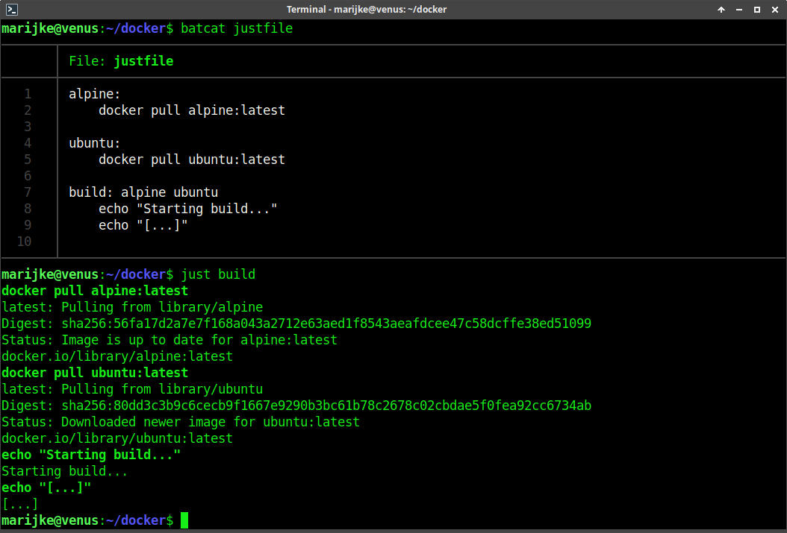

## 3. A simpler find -- with `.gitignore`  support

Use `fd` instead of `find`.

If provided, runs the specified command for each matching file.

```bash
$ fd [PATTERN]                     # or "fdfind [PATTERN]" on Debian/Ubuntu

$ fd [PATTERN] [-X command]
```

Note: Debian/Ubuntu install the executable under the name `fdfind`.

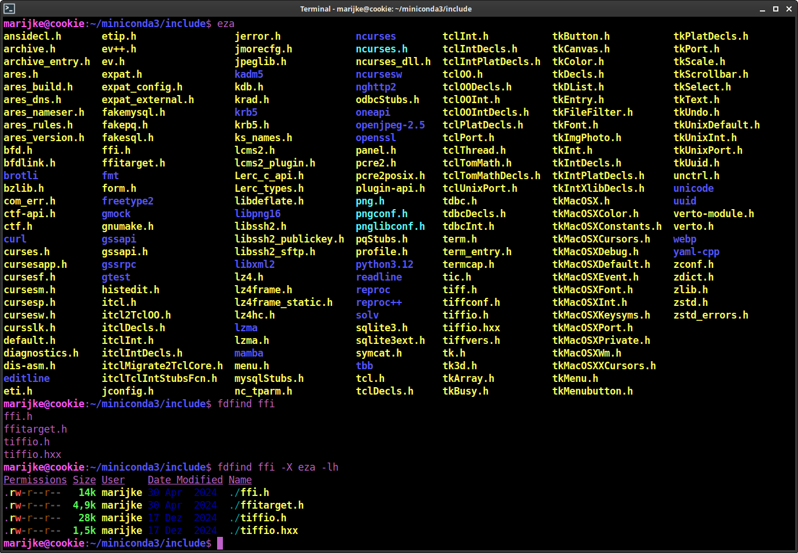

## 2. Pimp your shell -- with an informative prompt

Use the `starship` prompt modifier to display useful information,
e.g. the Git status.

It is best used together with a so-called "nerd font" (fonts enhanced with
thousands of icons).

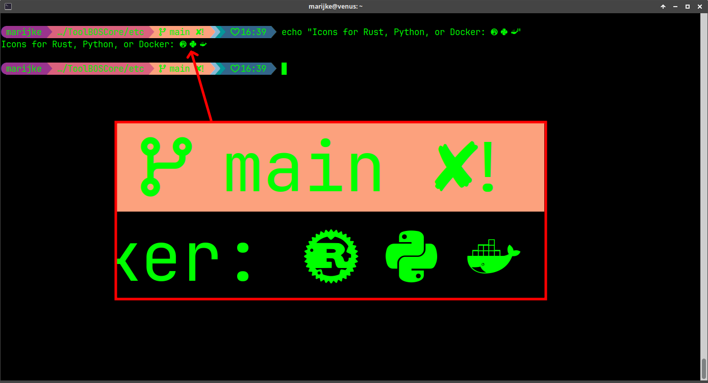

## 1. Reduce typing -- with a smart lean shell

Use `fish` instead of `bash`.

Press "➡️" to accept the command suggestion.

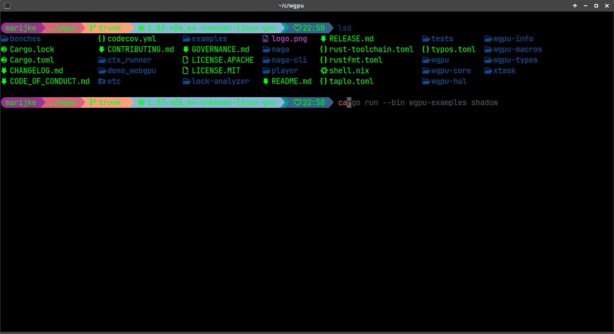

# Installation

## As normal user:

1. Install Rust toolchain:
    ```bash
    $ curl https://sh.rustup.rs -sSf | sh
    $ source "${HOME}/.cargo/env"
    ```

2. Install tools:
    ```bash
    $ cargo install eza fclones just ruplacer starship
    ```

3. Set up nerd font:
    ```bash
    $ mkdir -p ~/.local/share/fonts && cd ~/.local/share/fonts
    $ curl https://github.com/ryanoasis/nerd-fonts/releases/latest/download/JetBrainsMono.tar.xz
    $ tar xvf JetBrainsMono.tar.xz
    $ fc-cache -f -v
    ```
   As a last step, configure your terminal to use "JetBrainsMono Nerd Font".

4. Set up `starship`:
    ```bash
    $ starship preset pastel-powerline -o ~/.config/starship.toml
    ```

    Try it by running the activation command. You can add it to the end of
    your shell configuration file if you want to use it permanently:

    | Shell type   | Bash                           | Fish                           |
    |--------------|--------------------------------|--------------------------------|
    | Activation   | `eval "$(starship init bash)"` | `starship init fish \| source` |
    | Config file  | `~/.bashrc`                    | `~/.config/fish/config.fish`   |

5. Set up `eza` color theme

    Pick one from: https://github.com/eza-community/eza-themes, e.g. "Rosé Pine"
    ```bash
    $ mkdir -p ~/.config/eza
    $ cd ~/.config/eza
    $ curl -o theme.yml https://raw.githubusercontent.com/eza-community/eza-themes/refs/heads/main/themes/rose-pine.yml
    ```

## As admin

```bash
$ apt-get update
$ apt-get install bat btm eza fd-find fish
$ snap install fclones
```

Note: Ubuntu 22.04 ships with a version of `eza` that does not yet support color themes.

# Haven't had enough, yet??

OK, I've got something for you: [tools-2.md](tools-2.md) :)

## Weblinks

* bat: https://github.com/sharkdp/bat
* btm: https://github.com/ClementTsang/bottom
* eza: https://github.com/eza-community/eza
* fclones: https://github.com/pkolaczk/fclones
* fdfind: https://github.com/sharkdp/fd
* fend: https://github.com/printfn/fend
* fish: https://fishshell.com
* just: https://github.com/casey/just/tree/master
* Nerd fonts: https://www.nerdfonts.com
* ruplacer: https://github.com/your-tools/ruplacer
* starship: https://starship.rs

